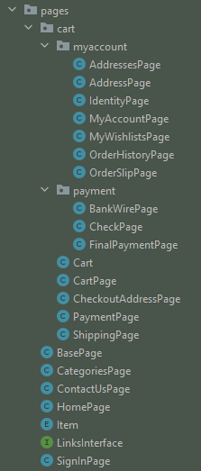

# GuardedGeckosAutomationPractice

## **Table Of Contents**
* [**Overview**](#overview)
* * [**Project Planning (Agile - Scrum)**](#project-planning)
    - [Sprint 1](#sprint-1)
    - [Sprint 2](#sprint-2)
    - [Sprint 3](#sprint-3)
    - [Sprint 4](#sprint-4)
    - [User Stories](#user-stories)
* [**Tools and Dependencies**](#tools-and-dependencies)
    - [IntelliJ](#intellij)
    - [Maven](#maven)
    - [JUnit Jupiter](#junit-jupiter)
    - [Cucumber Java](#cucumber-java)
    - [Cucumber JUnit](#cucumber-junit)
    - [Selenium Java](#selenium-java)
    - [Mockito Junit Jupiter](#mockito-junit-jupiter)
    - [Mockito Core](#mockito-core)
    - [Hamcrest All](#hamcrest-all)
    - [Web Driver Management](#web-driver-management)
    - [Jira](#jira)
* [**Page Object Model Classes**](#page-object-model-classes)
* [**Unit Testing**](#unit-testing)
* [**Behaviour-driven Development Tests**](#behaviour-driven-development-tests)
    - [Gherkin Language - Feature Files](#gherkin-languages-feature-files)
    - [Step Definitions](#step-definitions)
    - [TestRunner Class](#testrunner-class)
* [**Driver Factory Class**](#driver-factory-class)
    - [Configuration Properties](#configuration-properties)
* [**Assumptions**](#assumptions)
* [**Recommendations**](#recommendations)
* [**How to use the framework**](#how-to-use-the-project)
    - [Reporting](#reporting)

### **Overview**

In this project, web-based application testing framework was created for http://www.automationpractice.com website.

 

    <b><a href="#table-of-contents">↥ Back to top</a></b>

 

### **Project Planning (Agile - Scrum)**

Agile methodology and scrum framework was implemented. Sprint planning, daily stand-up, and retrospective meetings were hold. They helped the group members to have good communication across the team. Due to the nature of Agile, there were flexibility in our requirements and iterative approach was tracked. There were many user stories and 4 sprints there were in the management of the project.
 

    <b><a href="#table-of-contents">↥ Back to top</a></b>

 

#### Sprint 1

 

    <b><a href="#table-of-contents">↥ Back to top</a></b>

 

#### Sprint 2

 

    <b><a href="#table-of-contents">↥ Back to top</a></b>

 

#### Sprint 3

 

    <b><a href="#table-of-contents">↥ Back to top</a></b>

 

#### Sprint 4

 

    <b><a href="#table-of-contents">↥ Back to top</a></b>

 

#### User Stories

 

    <b><a href="#table-of-contents">↥ Back to top</a></b>

 

### **Tools and Dependencies**

Lots of different tools and dependencies were used in this project.

 

    <b><a href="#table-of-contents">↥ Back to top</a></b>

 

#### IntelliJ

Intellij is an integrated development environment(IDE) written in Java for developing computer software. There were many facilities helped the development of the project.

 

    <b><a href="#table-of-contents">↥ Back to top</a></b>

 

#### Maven

Maven is a build automation tool used primarily for Java projects. It has different lifecycles that the project can be managed in its different parts separately and reports can be produced using lifecycle. Plus, there are some plugins that the project can be configured.

 

    <b><a href="#table-of-contents">↥ Back to top</a></b>

 

#### JUnit Jupiter

JUnit Jupiter is a dependency for unit testing in Java programming language. It is used to test our project internally. Also, assertions were used to check our tests.

 

    <b><a href="#table-of-contents">↥ Back to top</a></b>

 

#### Cucumber Java

Cucumber Java is a dependency to implement our test scenarios written in Gherkin language consisting of plain English such as When, Given, Then, Background etc. 

 

    <b><a href="#table-of-contents">↥ Back to top</a></b>

 

#### Cucumber JUnit

Cucumber JUnit is a dependency for Cucumber options that Cucumber tests can be managed and configured. 

 

    <b><a href="#table-of-contents">↥ Back to top</a></b>

 

#### Selenium Java

Selenium Java is a dependency that web elements can be automated. It also provides automated web drivers to use for testing.

 

    <b><a href="#table-of-contents">↥ Back to top</a></b>

 

#### Mockito Junit Jupiter

Mockito JUnit Jupiter is a dependency which mocks can be initialized. Mocks are initialized before each test method.

 

    <b><a href="#table-of-contents">↥ Back to top</a></b>

 

#### Mockito Core

Mockito Core is a dependency which objects can be mocked. In this project, mocking was used to be able to make some layers of the project independent of other layers and making sure that it is working.  

 

    <b><a href="#table-of-contents">↥ Back to top</a></b>

 

#### Hamcrest All

 

    <b><a href="#table-of-contents">↥ Back to top</a></b>

 

#### Web Driver Management

Web Driver Management is a dependency which enables us to use different browsers without adding .exe files to our project. If somehow it doesn't work, we need to have .exe files for the browser we want to use so that, by the help of Selenium, we can use these browsers.

 

    <b><a href="#table-of-contents">↥ Back to top</a></b>

 

#### Jira

Jira is a track management tool that allows bug tracking and agile project management. Lots of user stories were created and assigned them to the responsible in Jira. 

 

    <b><a href="#table-of-contents">↥ Back to top</a></b>

 

### **Page Object Model Classes**

Page Object Model (POM) is a design pattern in Selenium which a class can be created to locate all the elements in each page of the website. Therefore, you don't need to locate web elements for every time that you need them. The only thing you need to do is just to create a class and locate all web elements and create reusable methods inside the class one time, and use it many times. There are plenty of POM classes we have in this project as you can see them below.

 

    <b><a href="#table-of-contents">↥ Back to top</a></b>

 

### **Unit Testing**

 

    <b><a href="#table-of-contents">↥ Back to top</a></b>

 

### **Behaviour-driven Development Tests**

 

    <b><a href="#table-of-contents">↥ Back to top</a></b>

 

#### Gherkin Language - Feature Files

 

    <b><a href="#table-of-contents">↥ Back to top</a></b>

 

#### Step Definitions

 

    <b><a href="#table-of-contents">↥ Back to top</a></b>

 

#### TestRunner Class

 

    <b><a href="#table-of-contents">↥ Back to top</a></b>

 

### **Driver Factory Class**

 

    <b><a href="#table-of-contents">↥ Back to top</a></b>

 

#### Configuration Properties

 

    <b><a href="#table-of-contents">↥ Back to top</a></b>

 

### **Assumptions**

 

    <b><a href="#table-of-contents">↥ Back to top</a></b>

 

### **Recommendations**

 

    <b><a href="#table-of-contents">↥ Back to top</a></b>

 

### **How to use the framework**

 

    <b><a href="#table-of-contents">↥ Back to top</a></b>

 

#### Reporting

 

    <b><a href="#table-of-contents">↥ Back to top</a></b>

 

|  Test ID | Bug Description  | Steps to reproduce  | Expected Result  | Environment  |
|:--------:|:----------------:|:-------------------:|:----------------:|:------------:|
|   |   |||||
||||||||
||||
