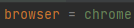

# GuardedGeckosAutomationPractice

## **Table Of Contents**
* [**Overview**](#overview)
* * [**Project Planning (Agile - Scrum)**](#project-planning)
    - [User Stories](#user-stories)
* [**Tools and Dependencies**](#tools-and-dependencies)
    - [IntelliJ](#intellij)
    - [Maven](#maven)
    - [JUnit Jupiter](#junit-jupiter)
    - [Cucumber Java](#cucumber-java)
    - [Cucumber JUnit](#cucumber-junit)
    - [Selenium Java](#selenium-java)
    - [Mockito Junit Jupiter](#mockito-junit-jupiter)
    - [Mockito Core](#mockito-core)
    - [Web Driver Management](#web-driver-management)
    - [Jira](#jira)
* [**Page Object Model Classes**](#page-object-model-classes)
* [**Unit Testing**](#unit-testing)
* [**Behaviour-driven Development Tests**](#behaviour-driven-development-tests)
    - [Gherkin Language - Feature Files](#gherkin-languages-feature-files)
    - [Step Definitions](#step-definitions)
    - [TestRunner Class](#testrunner-class)
* [**Driver Factory Class**](#driver-factory-class)
    - [Configuration Properties](#configuration-properties)
* [**How to use the framework**](#how-to-use-the-project)
    - [Reporting](#reporting)

### **Overview**

In this project, web-based application testing framework was created for http://www.automationpractice.com website.

 

    <b><a href="#table-of-contents">↥ Back to top</a></b>

 

### **Project Planning (Agile - Scrum)**

Agile methodology and scrum framework was implemented. Sprint planning, daily stand-up, and retrospective meetings were hold. They helped the group members to have good communication across the team. Due to the nature of Agile, there were flexibility in our requirements and iterative approach was tracked. There were many user stories and 4 sprints there were in the management of the project.
 

    <b><a href="#table-of-contents">↥ Back to top</a></b>

 

#### User Stories

We created epics first scuh as login, navigation, catalogue, product images, comparing products, account management, cart and then, they were split into the user stories.

Some user stories are as described below: 

_As a user, when I enter my correct information, I expect to be able to log in and see the user information._

_As a user, I want to hover over a product to see the options to see: colours, add to cart, add to wishlist, add to compare, click more to see if its in stock as well as price._

_As a user I should be able to click contact us to get to access to the contact page._

_As a user, I want to be able to see my saved addresses._

 

    <b><a href="#table-of-contents">↥ Back to top</a></b>

 

### **Tools and Dependencies**

Lots of different tools and dependencies were used in this project.

 

    <b><a href="#table-of-contents">↥ Back to top</a></b>

 

#### IntelliJ

Intellij is an integrated development environment(IDE) written in Java for developing computer software. There were many facilities helped the development of the project.

 

    <b><a href="#table-of-contents">↥ Back to top</a></b>

 

#### Maven

Maven is a build automation tool used primarily for Java projects. It has different lifecycles that the project can be managed in its different parts separately and reports can be produced using lifecycle. Plus, there are some plugins that the project can be configured.

 

    <b><a href="#table-of-contents">↥ Back to top</a></b>

 

#### JUnit Jupiter

JUnit Jupiter is a dependency for unit testing in Java programming language. It is used to test our project internally. Also, assertions were used to check our tests.

 

    <b><a href="#table-of-contents">↥ Back to top</a></b>

 

#### Cucumber Java

Cucumber Java is a dependency to implement our test scenarios written in Gherkin language consisting of plain English such as When, Given, Then, Background etc. 

 

    <b><a href="#table-of-contents">↥ Back to top</a></b>

 

#### Cucumber JUnit

Cucumber JUnit is a dependency for Cucumber options that Cucumber tests can be managed and configured. 

 

    <b><a href="#table-of-contents">↥ Back to top</a></b>

 

#### Selenium Java

Selenium Java is a dependency that web elements can be automated. It also provides automated web drivers to use for testing.

 

    <b><a href="#table-of-contents">↥ Back to top</a></b>

 

#### Mockito Junit Jupiter

Mockito JUnit Jupiter is a dependency which mocks can be initialized. Mocks are initialized before each test method.

 

    <b><a href="#table-of-contents">↥ Back to top</a></b>

 

#### Mockito Core

Mockito Core is a dependency which objects can be mocked. In this project, mocking was used to be able to make some layers of the project independent of other layers and making sure that it is working.  

 

    <b><a href="#table-of-contents">↥ Back to top</a></b>

 

#### Web Driver Management

Web Driver Management is a dependency which enables us to use different browsers without adding .exe files to our project. If somehow it doesn't work, we need to have .exe files for the browser we want to use so that, by the help of Selenium, we can use these browsers.

 

    <b><a href="#table-of-contents">↥ Back to top</a></b>

 

#### Jira

Jira is a track management tool that allows bug tracking and agile project management. Lots of user stories were created and assigned them to the responsible in Jira. 

 

    <b><a href="#table-of-contents">↥ Back to top</a></b>

 

### **Page Object Model Classes**

Page Object Model (POM) is a design pattern in Selenium which a class can be created to locate all the elements in each page of the website. Therefore, you don't need to locate web elements for every time that you need them. The only thing you need to do is just to create a class and locate all web elements and create reusable methods inside the class one time, and use it many times. There are plenty of POM classes we have in this project as you can see them below.

 

    <b><a href="#table-of-contents">↥ Back to top</a></b>

 

### **Unit Testing**

We did unit testing to amke sure that every development we did are working fine before merging to dev to avoid any conflict. We also used mocking and spy in this classes to make sure that our codes in POM classes are working fine even if there is no connection to the website we are testing.

 

    <b><a href="#table-of-contents">↥ Back to top</a></b>

 

### **Behaviour-driven Development Tests**

BDD approach is for people who are not technical. So, it makes the test scenarios understandable for those people. It causes to have clear communication across technical and non-technical people. 

 

    <b><a href="#table-of-contents">↥ Back to top</a></b>

 

#### Gherkin Language - Feature Files

We have different keywords in Gherkin language for example When, Given, Then, Background, Scenario, Scenario Outline with a set of examples etc. So we can use them to have tests consisting of plain English. One of the important benefits that feature files have is to be able to write same statement effortlessly so you don't need to write step definition method again if you implemented once before for that specific statement in feature file.

 

    <b><a href="#table-of-contents">↥ Back to top</a></b>

 

#### Step Definitions

What was written with Gherkin language in feature files were implemented in step definitions classes. We used @Before and @After annotations to run at the beginning ang end of the scenario.

 

    <b><a href="#table-of-contents">↥ Back to top</a></b>

 

#### TestRunner Class

This is the class that behaves like the brain of our framework. You can configure our tests in this class. You can decide which test scenarios are wanted to run and different types of reports. This is the class that makes feature files and step definition classes connected. 

 

    <b><a href="#table-of-contents">↥ Back to top</a></b>

 

### **Driver Factory Class**

DriverFactory class is created in singleton pattern design to make sure that there is only one object of the web driver. Since web driver management dependency was used, we don't have to add any .exe files to our project. But if it doesn't support in any way, then we need to add those files to our project.

 

    <b><a href="#table-of-contents">↥ Back to top</a></b>

 

#### Configuration Properties

Configuration properties file is where we specify which browser we want to use. We can switch to another browser which is already in DriverFactory class by changing one word. 

Instead of _chrome_, we can write _chrome-headless_, _firefox_, _firefox-headless_, _ie_ and _edge_ if we are using windows, _safari_ if we are using mac, _chrome-nexus-5_ and _chrome-galaxy-s5_. These will trigger the specified web driver run.

 

    <b><a href="#table-of-contents">↥ Back to top</a></b>

 

### **How to use the framework**

What you need to do is to create scenarios in feature files and implement them in step definitions by calling an object for each POM class which is related to the tests that we want to write. After preparing step definitions, you can run your tests using TestRunner class and make configuration. You can generate useful reports for the scenarios to see whether it fails or not. 
 

    <b><a href="#table-of-contents">↥ Back to top</a></b>

 

#### Reporting

We generated different kinds of reports such as pretty, html, and json. When the scenario failed, the image of website where fail occurred attaches to the report. We can also create tests for different types of testing such as Regression, Sanity, Smoke, Integration, Compatibility etc. using the tags in Cucumber options. 

 

    <b><a href="#table-of-contents">↥ Back to top</a></b>

 

